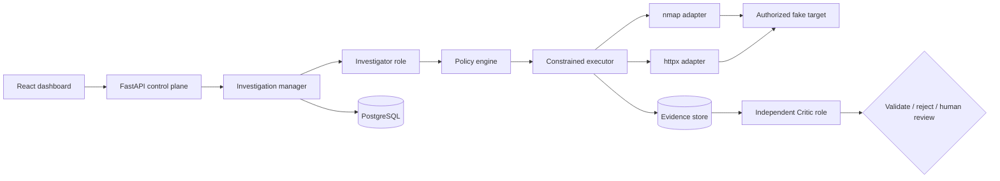

# SentinelLoop

> An evidence-first AI security investigator for explicitly authorized lab environments.

SentinelLoop turns scanner output into a controlled investigation loop:

```text
observe → hypothesize → authorize tool call → collect evidence → independent critique → validate or escalate
```

It is deliberately **not** an autonomous public-target pentesting bot. The included target is a scripted local service, every tool action is read-only and schema-bound, and the policy engine rejects anything outside the in-code allowlist.

## What the MVP demonstrates

- Two cooperating AI roles with different prompts, schemas, budgets, and provider configuration: an **Investigator** proposes hypotheses/tests and a **Critic** challenges the conclusion.
- Exactly two real security-tool adapters: `nmap` XML service discovery and ProjectDiscovery `httpx` JSON web inspection.
- A thin but enforced policy boundary: target allowlist, tool allowlist, read-only operation, local path validation, host/scope match, and call ceiling.
- Normalized, persisted evidence that remains distinct from hypotheses and findings.
- The validation invariant: a finding can never reach `VALIDATED` if the Investigator or Critic failed.
- Visible degradation for tool failure, model outage, rate/timeout errors, and malformed model JSON.
- A deterministic 10-scenario evaluation harness and a demo-safe failure selector.
- A minimal dashboard, PostgreSQL persistence, audit events, fake target, and Docker Compose deployment.

## Run the complete demo

Requirements: Docker Desktop with Compose.

```bash
docker compose up --build
```

Then open:

- Dashboard: [http://localhost:3000](http://localhost:3000)
- API documentation: [http://localhost:8000/docs](http://localhost:8000/docs)

The default `AI_MODE=deterministic` keeps the hackathon demo offline and repeatable while still executing the two role contracts independently. To use hosted models, copy `.env.example` to `.env`, set `AI_MODE=live`, and configure the Investigator and Critic credentials/model names independently. Both clients use the OpenAI-compatible `POST /chat/completions` contract.

## Five-minute demo

1. Keep **Happy path** selected and run an investigation.
2. Show service evidence, the exposed `/admin` finding, missing-header finding, and the rejected `/api/debug` false positive.
3. Open each hypothesis to contrast Investigator confidence with the Critic verdict.
4. Select **Fail web tool**, **Kill Critic**, or **Malformed Critic JSON** and run again.
5. Show `DEGRADED_MODE`, explicit failure events, and `NEEDS_HUMAN_REVIEW` instead of a false validation.
6. Point to the evaluation card: ten fixed scenarios, false-positive count, and graceful-failure rate.

## Architecture



The backend never accepts a shell command from a model. A model may only return a validated `ToolRequest` naming one of two tools, the allowlisted target ID, a safe local path, and the `read_only` operation.

More detail: [architecture](docs/architecture.md), [threat model](docs/threat-model.md), [failure log](docs/failure-log.md), [evaluation](docs/evaluation.md), and [prior art](docs/prior-art.md).

## API surface

| Method | Endpoint | Purpose |
|---|---|---|
| `GET` | `/api/health` | Control-plane and database health |
| `GET` | `/api/targets` | Explicit target allowlist |
| `POST` | `/api/investigations` | Create an authorized investigation |
| `POST` | `/api/investigations/{id}/start` | Execute the bounded investigation loop |
| `GET` | `/api/investigations/{id}` | Full state, evidence, findings, metrics, and audit events |
| `POST` | `/api/investigations/{id}/approve` | Acknowledge human-review handoff |
| `GET` | `/api/evaluations` | Run the fixed evaluation suite |
| `POST` | `/api/debug/inject-failure` | Set a demo-only tool/model/malformed-output failure |

## Local development

Backend:

```bash
python -m venv .venv
.venv/Scripts/pip install -r backend/requirements.txt
$env:PYTHONPATH = "backend"
uvicorn app.main:app --reload --port 8000
```

The SQLite fallback is used outside Compose. Use Compose for real tool execution against the internal controlled target.

Frontend:

```bash
cd frontend
npm install
npm run dev
```

Evaluation and tests:

```bash
python evaluation/run_evaluation.py
pytest backend/tests -q
cd frontend && npm run build
```

## Safety and scope

- Never add public IPs or third-party hostnames to the target seed.
- Never expose arbitrary subprocess arguments to model output.
- Never replace the observation-only tools with exploitation frameworks.
- Disable `DEBUG_FAILURES_ENABLED` outside demo/development environments.
- Hosted-model credentials belong in environment variables, never source control.

SentinelLoop is a hackathon validation system, not a production security appliance or a replacement for professional penetration testing.

## Cost ceiling

The default budgets are 8 Investigator calls, 5 Critic calls, and 10 tool calls per investigation. The demo loop uses one Investigator call, three Critic calls, and four tool calls. The dashboard states a **$0.03 target ceiling per investigation**; actual cost depends on configured providers and models. Deterministic mode makes no paid model calls.

## License

[MIT](LICENSE)
