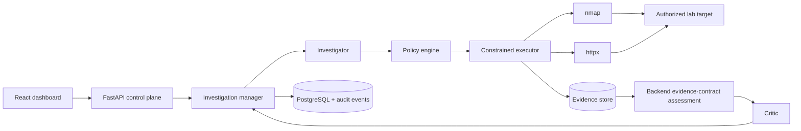

# SentinelLoop

> An evidence-first, AI-assisted security validation control plane for explicitly authorized laboratory targets.

SentinelLoop turns a small set of read-only observations into an auditable investigation loop. It separates tool observations from AI hypotheses, and separates the Investigator's provisional claim from the Critic's independent assessment.

```text
observe → hypothesize → authorize → inspect → normalize evidence → critique → decide or escalate
```

It is deliberately **not** an autonomous scanner, public-target testing tool, or exploitation framework. Use it only for targets you own or are explicitly authorized to assess.

## Hackathon submission

### Submission links

| Item | Link / status |
|---|---|
| Source code and detailed documentation | [GitHub repository](https://github.com/abhinavshiv7/VocalAI_Hackathon) |
| Local live demo | [http://localhost:3000](http://localhost:3000) after running Docker Compose |
| Deployed demo | [http://34.131.158.227:3000](http://34.131.158.227:3000/) |
| Demo video **(required)** | **Add the final public Drive or video link here before submitting.** |
| Screenshots / supporting material | Dashboard and Evaluation workspace screenshots can be captured from the running local or deployed app. |

### Required final-submission checklist

- [x] GitHub repository URL and detailed technical documentation
- [x] Clear project overview, implementation details, roles, technical decisions, and challenges
- [ ] Public demo-video URL added above
- [ ] Complete submission folder uploaded to Drive and sharing permissions verified

### What we built

We built SentinelLoop, a constrained AI security-validation workflow for authorized lab environments. Instead of asking an AI to scan or exploit a target, the application applies a controlled evidence loop: a read-only tool collects an observation; the Investigator produces a provisional, structured claim; backend policy verifies every action; and the Critic reviews the evidence before the backend decides whether to validate, reject, or escalate the item.

The result is a demonstrable full-stack product that combines a React dashboard, FastAPI control plane, PostgreSQL audit store, Docker-isolated lab target, limited security-tool adapters, two AI roles, structured outputs, deterministic evaluation, and safety-focused failure handling.

### Work completed

- Designed and implemented the evidence-first investigation state machine.
- Built the React dashboard with Investigation, Evaluation, and Audit Trail workspaces.
- Added target onboarding with authorization attestation, approved-path scope, and optional administrator host allowlisting.
- Integrated constrained `nmap` and `httpx` adapters and normalized their observations into durable evidence records.
- Implemented separate Investigator and Critic prompts, schemas, provider settings, retries, failure logging, and model-output validation.
- Added backend evidence contracts so supported claims have explicit proof and rejection rules that models cannot override.
- Built a deterministic evaluation dataset and failure-injection experience to demonstrate false-positive prevention and graceful degradation.
- Containerized the frontend, backend, PostgreSQL database, and isolated controlled target with Docker Compose; documented VM deployment configuration.
- Added architecture, threat-model, evaluation, failure-log, deployment, and prior-art documentation.

### Team roles and contribution

SentinelLoop was built by two developers with clearly separated but integrated ownership areas.

#### Abhinav — Core orchestration, Investigator, and policy engine

**Owns:** The backend investigation state machine, Investigator model integration, structured JSON and Pydantic validation, and the Policy Engine.

- **Originality:** Built the hypothesis-driven loop rather than a generic LLM chat flow. The Investigator produces a structured security hypothesis and a bounded tool request; backend policy checks the target, tool, path, read-only operation, and budget before any tool executes.
- **Technical depth:** Implemented strict schema parsing and Pydantic validation for model output, including bounded retries and corrective feedback when a hosted model returns malformed JSON.
- **Failure awareness:** Owns the model-failure and graceful-degradation path. Provider outages, timeouts, rate limits, and unusable model output halt the affected conclusion at `NEEDS_HUMAN_REVIEW` rather than crashing the workflow or producing a fabricated finding.

#### Hariharan S — Security tooling, Critic AI, and evaluation harness

**Owns:** The `nmap` and `httpx` adapters, evidence normalization, Critic model integration, deterministic evaluation harness, and demo-safe tool-failure controls.

- **Originality:** Built the two-model cooperation pattern. The Investigator proposes a provisional claim, while an independent Critic challenges assumptions, identifies missing evidence, and prevents overconfident conclusions.
- **Technical depth:** Implemented the normalization layer that transforms raw `nmap` XML and `httpx` JSON output into a consistent persisted evidence store. Also built the 8–10 scenario evaluation harness used to measure correct conclusions, false positives, and graceful failure behavior.
- **Failure awareness:** Owns tool-failure handling and the demo-safe toggle. Read-only tool execution has timeout wrappers, and `POST /api/debug/inject-failure` simulates tool loss cleanly for an on-stage failure demonstration.

### Key technical decisions and challenges

| Decision / challenge | How SentinelLoop addresses it |
|---|---|
| Preventing an AI from acting as an unrestricted security tool | The model outputs a small schema-bound tool request; backend code enforces target, path, tool, operation, and budget rules. |
| Distinguishing observations from conclusions | Evidence, hypotheses, Critic decisions, and findings are stored and displayed separately. |
| Reducing false positives | Every supported hypothesis has proof and rejection evidence rules. Conflicting, incomplete, malformed, or failed evidence becomes human review. |
| Handling unreliable model providers | Provider errors, rate limits, timeouts, and malformed JSON are logged and lead to safe degradation rather than an invented result. |
| Supporting a reliable hackathon demo | Deterministic mode, a controlled lab target, a ten-scenario evaluation suite, and demo failure injection make the workflow reproducible without live-model quota. |
| Deploying a browser-based frontend | The public API URL is configured at frontend build time, with matching backend CORS configuration documented for VM deployment. |

## Contents

- [Capabilities](#capabilities)
- [Safety and authorization](#safety-and-authorization)
- [Architecture](#architecture)
- [Quick start](#quick-start)
- [Live AI configuration](#live-ai-configuration)
- [Dashboard workflow](#dashboard-workflow)
- [API reference](#api-reference)
- [Testing and evaluation](#testing-and-evaluation)
- [Deployment](#deployment)
- [Limitations](#limitations)

## Capabilities

- **Two independent roles:** the Investigator proposes bounded hypotheses; the Critic reviews only normalized evidence and cannot execute tools.
- **Structured AI contracts:** model output validates against Pydantic schemas. Each hypothesis carries a validation contract: claim type, verification path, proof evidence, and rejection evidence.
- **Backend-enforced decisions:** supported claim types are deterministically validated, rejected, or marked inconclusive. A model cannot turn an observed `401` or `403` into a validated unauthenticated-access finding.
- **Read-only adapters:** only `nmap` service discovery and ProjectDiscovery `httpx` HTTP inspection are executable. Models never submit shell commands or arbitrary arguments.
- **Evidence and audit trail:** normalized observations, tool runs, decisions, costs, failures, and findings are persisted in PostgreSQL and shown in the dashboard.
- **Target-scoped retrieval:** the Investigator receives only the selected target's approved paths and verification context. Retrieved context is never proof on its own.
- **Safe degradation:** tool timeouts, model outages, rate limits, malformed JSON, and policy violations become `NEEDS_HUMAN_REVIEW`, never an unsafe validation.
- **Evaluation harness:** ten deterministic scenarios measure correct conclusions, false positives, confidence calibration, and graceful failure handling.
- **Dynamic onboarding:** attested mode supports authorized lab-target registration; allowlisted mode supports administrator-managed host restrictions.

## Safety and authorization

| Control | Backend enforcement |
|---|---|
| Target scope | A target must be registered with an authorization attestation. Optional allowlisted mode restricts hosts further. |
| Path scope | Targets have approved local paths only. URLs, traversal, credentials, queries, and fragments are rejected. |
| Tool scope | Models may select only `network_discovery` or `web_inspection`. |
| Operation | Every model-originated request is constrained to `read_only`. |
| Budgets | Investigator, Critic, and tool-call ceilings are enforced per investigation. |
| Final decision | Only backend logic creates `VALIDATED` findings, and only from direct contract evidence with no failed boundary. |

Do not add public or third-party systems merely to experiment with the application.

## Architecture



### Investigation lifecycle

1. A user creates an investigation for an authorized target.
2. The manager performs bounded, read-only discovery.
3. The Investigator receives discovery evidence plus target-scoped knowledge.
4. It returns schema-valid hypotheses, each with one primary tool request and an explicit validation contract. One distinct follow-up request may be pre-planned.
5. The policy engine validates the target, path, tool, operation, and budget before execution.
6. Tool output becomes normalized evidence such as `AUTH_CONTROL_OBSERVED`, `MISSING_SECURITY_HEADERS`, or `ADMIN_EXPOSURE`.
7. The backend computes an authoritative evidence assessment, and the Critic explains that supported decision.
8. The manager validates, rejects, gathers one permitted follow-up observation, or hands the item to human review.

The prompts in [`backend/app/prompts`](backend/app/prompts) are defense in depth. Authorization, execution, persistence, and final validation remain backend responsibilities.

## Quick start

### Prerequisites

- Docker Desktop with Docker Compose
- Node.js 22.13+ for frontend-only development
- Python 3.13 recommended for backend-only development

### Run the full local demo

```bash
docker compose up --build
```

Open the following URLs:

- Dashboard: [http://localhost:3000](http://localhost:3000)
- API documentation: [http://localhost:8000/docs](http://localhost:8000/docs)
- Health check: [http://localhost:8000/api/health](http://localhost:8000/api/health)

The default `AI_MODE=deterministic` is offline and repeatable for demonstrations. It still runs separate Investigator and Critic contracts, policy checks, tools, evidence persistence, and evaluation.

Stop the stack with:

```bash
docker compose down
```

## Configuration

Create the local environment file:

```powershell
Copy-Item .env.example .env
```

On macOS/Linux, use `cp .env.example .env`. `.env` is Git-ignored; never commit API keys.

| Variable | Purpose |
|---|---|
| `AI_MODE` | `deterministic` for offline demo mode; `live` for hosted-model calls. |
| `TARGET_REGISTRATION_MODE` | `attested` for user-attested lab onboarding; `allowlisted` for administrator-controlled hosts. |
| `AUTHORIZED_TARGET_HOSTS` | Comma-separated hosts permitted in `allowlisted` mode. |
| `MAX_INVESTIGATOR_CALLS`, `MAX_CRITIC_CALLS`, `MAX_TOOL_CALLS` | Per-investigation call ceilings. |
| `MODEL_TIMEOUT_SECONDS` | Maximum duration of a hosted-model request. |
| `MODEL_RETRY_ATTEMPTS`, `MODEL_RETRY_MAX_DELAY_SECONDS` | Bounded retry behavior for provider errors. |
| `DEBUG_FAILURES_ENABLED` | Enables demo-only failure injection; set to `false` outside development. |

## Live AI configuration

Set `AI_MODE=live` and configure Investigator and Critic independently. This makes it possible to use different providers or models for proposal and review.

### OpenAI-compatible providers

The generic client supports providers exposing OpenAI-compatible `POST /chat/completions`, including OpenAI-compatible gateways and Groq.

```env
AI_MODE=live

INVESTIGATOR_BASE_URL=https://api.example.com/v1
INVESTIGATOR_API_KEY=replace-with-investigator-key
INVESTIGATOR_MODEL=provider-model-id

CRITIC_BASE_URL=https://api.example.com/v1
CRITIC_API_KEY=replace-with-critic-key
CRITIC_MODEL=provider-model-id
```

For Groq, use `https://api.groq.com/openai/v1` and a model enabled in the account. A single provider can serve both roles for a demo, but prompts, schemas, and backend decision rules remain separate.

### Anthropic Messages API

When the base URL is `https://api.anthropic.com`, SentinelLoop detects it and uses Anthropic's Messages API instead of Chat Completions:

```env
CRITIC_BASE_URL=https://api.anthropic.com
CRITIC_API_KEY=replace-with-anthropic-key
CRITIC_MODEL=claude-haiku-4-5
```

The provider account must have usable API credit and quota. Provider-side billing and rate limits cannot be increased by this application; SentinelLoop records those failures and hands off safely.

## Dashboard workflow

### Investigation workspace

1. Select an authorized target, or choose **Register authorized lab target** and add approved paths.
2. Keep **Happy path** selected for a normal run.
3. Select **Run investigation**.
4. Inspect Observe, Hypothesize, Investigate, Critique, and Decide.
5. Use the **Hypotheses**, **Evidence**, and **Audit** tabs to trace each conclusion.
6. Acknowledge human review only after a qualified reviewer has examined the record.

### Demo failure injection

The development UI can simulate:

- Fail web tool
- Kill Investigator
- Kill Critic
- Malformed Critic JSON

Each scenario must produce visible degradation and `NEEDS_HUMAN_REVIEW`, not a false validation.

### Evaluation workspace

The Evaluation view runs ten fixed deterministic scenarios and reports correct conclusions, false positives, confidence behavior, and failure handling. It is the quickest way to demonstrate core reliability without consuming model quota.

## API reference

| Method | Endpoint | Purpose |
|---|---|---|
| `GET` | `/api/health` | Control-plane and database health. |
| `GET` | `/api/targets` | List registered authorized targets. |
| `POST` | `/api/targets` | Register an attested lab target. |
| `GET` | `/api/tools` | Describe permitted tool adapters. |
| `POST` | `/api/investigations` | Create an investigation for an authorized target. |
| `POST` | `/api/investigations/{id}/start` | Run the bounded investigation lifecycle. |
| `GET` | `/api/investigations` | List recent investigations. |
| `GET` | `/api/investigations/{id}` | Return hypotheses, evidence, findings, metrics, and audit events. |
| `POST` | `/api/investigations/{id}/approve` | Acknowledge a human-review handoff. |
| `GET` | `/api/evaluations` | Run the deterministic evaluation suite. |
| `GET` / `POST` | `/api/debug/inject-failure` | Read or configure demo-only failure injection. |

Interactive OpenAPI documentation is available at `/docs` while the backend is running.

## Testing and evaluation

Run backend tests inside Compose:

```bash
docker compose exec -T backend pytest tests -q
```

Run the deterministic evaluation suite:

```bash
docker compose exec -T backend python -c "import asyncio; from app.config import Settings; from app.services.evaluation import run_evaluation; print(asyncio.run(run_evaluation(Settings(ai_mode='deterministic'))))"
```

Run frontend checks:

```bash
cd frontend
npm install
npm run lint
npm run build
```

Evaluation scenarios are in [`evaluation/scenarios/scenarios.json`](evaluation/scenarios/scenarios.json). Add a regression scenario whenever a claim type, normalization rule, or failure case changes.

## Deployment

`NEXT_PUBLIC_API_URL` is embedded in the frontend bundle during image build. For a VM, it must be reachable from the browser rather than pointing to `localhost`:

```env
NEXT_PUBLIC_API_URL=http://YOUR_VM_IP:8000
FRONTEND_ORIGIN=http://YOUR_VM_IP:3000
```

Rebuild the application services:

```bash
docker compose up --build -d frontend backend
```

For remote deployments, restrict network exposure, set `DEBUG_FAILURES_ENABLED=false`, use a secret manager where appropriate, and keep the tool network isolated from public networks. See [deployment guidance](docs/deployment.md).

## Project structure

```text
backend/
  app/
    prompts/          # Investigator and Critic system instructions
    services/         # Orchestration, policy, AI client, tools, evaluation
    schemas.py        # Structured model and API contracts
    main.py           # FastAPI routes
frontend/
  app/                # Dashboard interface
fake-target/          # Controlled Express lab target
evaluation/scenarios/ # Deterministic evaluation dataset
docs/                 # Architecture, threat model, deployment, prior art
docker-compose.yml    # Full local stack
```

## Limitations

- SentinelLoop supports narrow, read-only service and HTTP/header observations only.
- It does not authenticate, exploit, mutate targets, crawl arbitrary sites, or validate broad business-logic claims.
- A `200` response alone is not a vulnerability. Unsupported or ambiguous evidence remains inconclusive.
- Hosted-model quality and availability depend on the configured provider account, model, billing, and rate limits.
- This is a hackathon project, not a production penetration-testing platform or replacement for human security review.

## Further documentation

- [Architecture](docs/architecture.md)
- [Threat model](docs/threat-model.md)
- [Evaluation notes](docs/evaluation.md)
- [Failure log](docs/failure-log.md)
- [Prior art](docs/prior-art.md)
- [Deployment](docs/deployment.md)

## License

[MIT](LICENSE)
