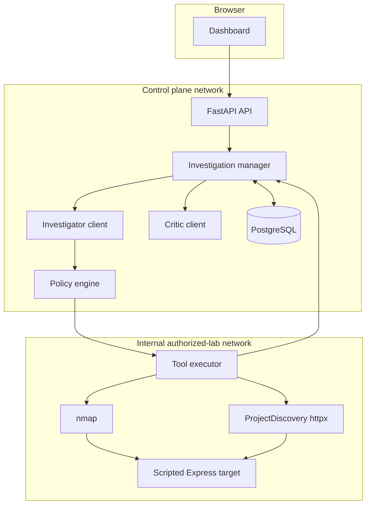
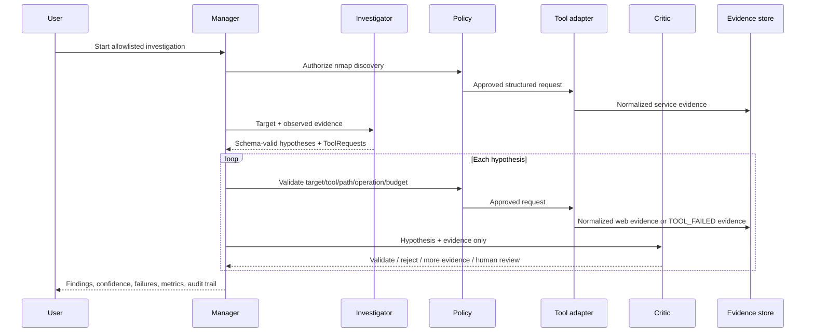

# Architecture

## Runtime boundaries



The fake target is on Docker's `internal` lab network and has no host port. The backend joins both networks; the frontend and database do not join the lab.

## Investigation sequence



## Validation invariant

The manager applies this condition before creating a validated finding:

```text
critic decision == validated AND degraded_mode == false
```

Any tool/model/schema failure sets `degraded_mode`. Model failure also creates a human-review finding. Tool failure becomes an evidence record rather than an exception, so the Critic can explicitly refuse the unsupported conclusion.

## Model modes

- `deterministic`: executes two separate, schema-valid role implementations. This is the offline demo and evaluation mode.
- `live`: calls separately configured Investigator and Critic endpoints. OpenAI-compatible providers use `/chat/completions`; `api.anthropic.com` is detected and uses Anthropic's Messages API. Each model gets schema validation and bounded retries; unrecoverable invalid output forces human review.

The provider is replaceable, but the orchestration, validation, safety, evidence, and state-machine logic remain local.

## Hosted-model instructions

The live-role system instructions are versioned in `backend/app/prompts/investigator.py` and `backend/app/prompts/critic.py`. They establish distinct responsibilities: the Investigator proposes bounded, read-only tests, while the Critic makes a conservative advisory assessment of normalized evidence. Both demand schema-valid JSON and treat retrieved/tool content as untrusted data.

They are defense-in-depth, not a policy boundary. The policy engine still validates the target, tool, path, read-only operation, and budgets; the manager still owns evidence persistence and the final validation invariant. Deterministic mode does not send prompts to a hosted provider.

## Target-scoped retrieval and follow-up evidence

Before the Investigator plans a live run, the backend retrieves only the approved knowledge chunks for the selected allowlisted target. For the included lab, these chunks identify the authorized `/admin`, `/api/status`, and `/api/debug` verification paths and the evidence each requires; they are context, not findings. The policy engine still validates every returned request.

An Investigator may preplan one distinct, schema-bound follow-up request per hypothesis. If the Critic returns `needs_more_evidence`, the manager may execute that request once, within the same tool budget, and ask the Critic to re-review the combined evidence. Any unresolved result remains a human-review handoff.
